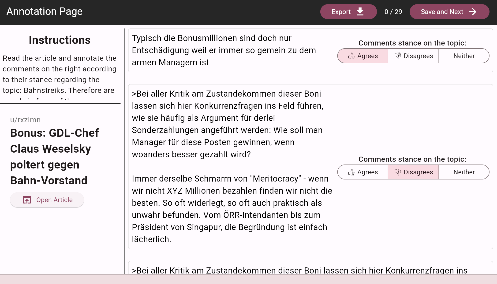

# Reddit Stance Annotator

This web-based tool allows users to annotate Reddit comments with stance information for research purposes.

## Features

- Upload JSON files containing Reddit submissions and comments
- Annotate comments with stances towards the submission topic and parent comments
- View comments in context of the discussion thread
- Export annotated data as JSON
- Progress tracking

## Usage

1. Open the web app in a browser
2. Upload a JSON file containing Reddit data
3. Annotate comments by selecting stance options
4. Use "Next" button to move through comment pages
5. Export annotated data using "Export" button

## Data Format

This is the input/output format of the data. Observe that the fields `stanceOnSubmission` and `stanceOnParent` are added by the tool while annotating.

## Submission Object

| Field | Description | Example |
|-------|-------------|---------|
| id | Unique identifier | 17v3qsh |
| title | Title of the submission | Deutsche Bahn: Lokführergewerkschaft GDL kündigt Streik an |
| score | Score of the submission | 349 |
| created | Creation Date and Time | 2023-11-14 15:45:00 |
| url | URL to the news article posted | https://www.tagesschau.de/eilmeldung/eilmeldung-7516.html |
| author | Author | u/Digag |
| branches | List of top-level comment objects | See Comment Object structure |

## Comment Object

| Field | Description | Example |
|-------|-------------|---------|
| id | Unique identifier | k97ud84 |
| author | Author of the comment | u/Noodleholz |
| body | Body text of the comment | Da bei uns die Bahn abwechselnd wegen... |
| created | Creation date and time of the comment | 2023-11-14 15:48 |
| score | Score of the comment | 123 |
| parent_id | ID of the submission for top-level comments (prefixed with t3), ID of the parent comment for subsequent comments (prefixed with t1) | t3_17v3qsh |
| link_id | ID of submission (prefixed with t3) | t3_17v3qsh |
| branches | Replies to the comment | More comment objects or an empty list |
| stanceOnSubmission | Stance label targeting the submission. Can be either {positive, negative, neither, null}, where null indicates the absence of an annotation. Labels should be interpreted as *In Favor*, *Against*, or *Neither*. | positive |
| stanceOnParent | Stance label targeting the parent comment. Can be either {positive, negative, neither, null}, where null indicates the absence of an annotation or that the comment has no parent and is a top-level comment. Labels should be interpreted as *Agrees*, *Disagrees*, or *Neither*. | negative |

## Data Storage

All data and annotations are stored locally in the browser. No server backend is used.

## Citation

If using this tool in research, please cite:

@software{Wostmann_Reddit_comments_stance_2024,
author = {Wöstmann, Felix},
doi = {10.5281/zenodo.13819363},
month = sep,
title = {{Reddit comments stance annotator app}},
url = {https://github.com/felixwoestmann/stance_annotator_app},
version = {1.0.0},
year = {2024}
}
